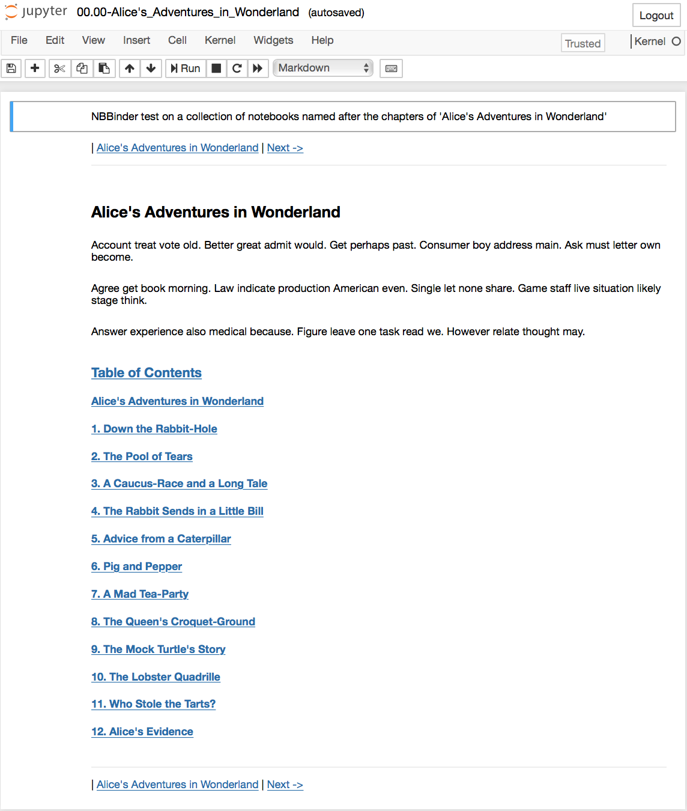

# Usage

## Cell markers

The **Table of Contents**, the **headers**, and the **navigators** appear in selected cells in the jupyter notebooks. These cells have **markers**, according to their types.

The markers are **html** comments, so they do not show up in the notebook, except when editing the cell, although the point is precisely to avoid editing them and create and update them automatically.

The markers are

```html
<!--TABLE_OF_CONTENTS--\>

<!--HEADER-->

<!--NAVIGATOR-->
```

and their names speak for themselves.

The cell has to start with one of theses markers to be understood as the appropriate cell.

The **header** cell is always the first one in the notebook, when present.

The **navigator** cells appear in two places in each notebook: as the last cell, for the bottom navigators, and as either the first or the second cell, depending on whether there is a **header** cell or not.

The **Table of Contents** cell can vary in position. It can be given a priori at some place in the *Table of Contents* notebook file, or it can be included automatically by the `nbbinder` script. In the former case, the author of the notebook is responsible for opening up a cell and typing up the marker in the beginning of the cell. In the later case, the `nbbinder` module will create the table of contents in either the second to last cell, if there is a bottom **navigator**, or as the very last cell, otherwise. It must be stressed that the module will first look for the marker somewhere in the notebook and use the corresponding cell if it finds it. Only if it doesn't find it that it will add a cell as the last or second to last cell.

If the `nbbinder` script is ran again, it will look for the marker cells and rewrite them with the updated information, removing any previous data.

## Restructuring the collection of notebooks

The method to insert a notebook in between other index notebooks is called `restructure()` and its definition starts with

```python
def restructure(app_to_notes_path='.'):
    ...
```

The `app_to_notes_path` is a non-required argument with the name of the folder in which the collection of notebooks is expected to be. It should be either an absolute path or a path relative to the current path in the script calling the method. If `app_to_notes_path` is not given, it is assumed to be the current directory.

This method reads all the Jupyter notebooks in the directory `app_to_notes_path` and look for those matching a regular expression indicating that the notebook is to be inserted in the collection.

## Creating the Table of Contents

The method to create, or update, the table of contents is called `add_contents()` and its definition starts with

```python
def add_contents(toc_nb_name, app_to_notes_path='.',
                 show_full_entry_in_toc=True):
    ...
```

The argument `toc_nb_name` is required and is the name of the jupyter notebook file in which the table of contents will be written.

The `app_to_notes_path` is a non-required argument with the name of the folder in which both the `toc_nb_name` file and the collection of all notebooks to be listed in the table of contents are expected to be. It should be either an absolute path or a path relative to where the code is being ran. If `app_to_notes_path` is not given, it is assumed to be the current directory.

The last variable, `show_full_entry_in_toc`, determines whether the entries in the *Table of Contents* should start with the chapter and section numbers or not. The default is `True`, but in some cases, such as when one wants to have **Lecture 1** displayed instead of **1. Lecture**, it is useful to have this option and set it to `False`.

## Creating the headers

The method to create, or update, the headers is called `add_headers()` and its definition starts with

```python
def add_headers(header, app_to_notes_path='.'):
    ...
```

The argument `add_headers` is required and is a string with the header you want to be displayed on top of each notebook.

The `app_to_notes_path` is a non-required argument with the name of the folder in which both the `toc_nb_name` file and the collection of all notebooks to be listed in the table of contents are expected to be. It should be either an absolute path or a path relative from where the code is being ran. If `app_to_notes_path` is not given, it is assumed to be the current directory.

## Creating the navigators

The method to create, or update, the navigator cells is called `add_navigators()` and its definition starts with

```python
def add_navigators(core_navigators=[], app_to_notes_path='.',
                   user = '', repository = '', branch = '',
                   github_nb_dir = '',
                   github_io_slides_dir = '',
                   show_colab=False, show_binder=False,
                   show_slides=False,
                   show_full_entry_in_nav=True):
    ...
```

There is no required argument.

Here is an explanation of the non-required arguments:

- `core_navigators` is a list of strings, where each element is the filename of a Jupyter notebook that you want to appear in the navigator bar, in between the links to the *previous* and the *next* notebooks. This is useful for direct links to the **Table of Contents** and the **Bibliography**, for instance. If it is not provided, it is assumed to be an empty list, and nothing is showed in between the links for the *previous* and *next* notebooks.

- `app_to_notes_path` is a non-required argument, with the name of the folder in which both the `toc_nb_name` file and the collection of all notebooks to be listed in the table of contents are expected to be. It should be either an absolute path or a path relative from where the code is being ran. If `app_to_notes_path` is not given, it is assumed to be the current directory.

- `user` is the username of the owner of the github repository which the notebooks belong to, if they do belong to one. It defaults to a blank string.

- `repository` is the name of the github repository which the notebooks belong to, if they do belong to one. It defaults to a blank string.

- `branch` is the name of the associated branch in the github repository. It defaults to a blank string.

- `github_nb_dir` is the path to the notebooks from the root directory of the github repository.

- `github_io_slides_dir` is the directory in the `user.github.io` where the slides associated to the notebooks reside, if they exist. It defaults to a blank string.

- `show_colab` is a `boolean` argument informing the method whether to display the badge with the link to open up the notebook in [Google Colab](https://colab.research.google.com/notebooks/welcome.ipynb) environment in the "cloud". This works if the notebooks are in a github repository. It defaults to `False`.

- `show_binder` is a `boolean` argument informing the method whether to display the badge with the link to open up the notebook in the [binder](https://mybinder.org/) environment in the "cloud". This works if the notebooks are in a github repository. It defaults to `False`.

- `show_full_entry_in_nav` indicates whether to display the chapter and section numbers in the navigation links along with the titles or just the titles. It defaults to `True`.

The colab and binder links, when displayed, appear *above* the navigation bar in the top navigator cell and *below* the navigation bar in the bottom navigator cell, which I found to be more aesthetically pleasing.

## Creating the book-like structure with all three elements

The method to create, or update, all the three elements (**Table of Contents**, **headers**, and **navigators**) is called `bind()` and its definition starts with

```python
def bind(toc_nb_name, header, core_navigators,
         app_to_notes_path='.',
         restructure_notebooks=False,
         user='', repository='', branch='',
         github_nb_dir='',
         github_io_slides_dir='',
         show_colab=False, show_binder=False,
         show_slides=False,
         show_full_entry_in_toc=True,
         show_full_entry_in_nav=True):
    ...
```

This method simply calls the previous four methods, in the following order:

- `restructure(...)`
- `add_contents(...)`
- `add_headers(...)`
- `add_navigators(...)`

Refer to the previous sections for each method and the nature of the required and non-required arguments.

## Creating the book-like structure from a configuration file

The easiest way to create/update the book-like structure of a collection of notebooks is by using a configuration file containing all the desired arguments (and elements).

The configuration file is expected to be in the [YAML](https://en.wikipedia.org/wiki/YAML) format, which is a human-readable, text file, which easily stores strings, integers, floating point numbers, booleans, lists, and dictionaries (and more). It is parsed to python via the [PyYAML](https://pyyaml.org/) module.

The method `bind_from_configfile(config_file)` expects the `config_file` to be parsed to a python dictionary with one or more of the following keys:

- `directory`
- `restructure`
- `book`
- `contents`
- `header`
- `navigator`

The value of each key is another dictionary, containing the parameters for the associated method.

The order of the main keys is not important. The module takes care of them regardless. There are some rules to follow:

- If `directory` is present, its value is send to the variable `app_to_notes_path`.
- If `restructure_notebooks` is present, the method `restructure()` is executed.
- If `book` is present, the method `bind()` is executed, with the parameters given in this key.
- If `book` is not present, the other methods are executed, depending on whether the corresponding key is present, and in the following order:
  - `add_contents()`;
  - `add_headers()`; and
  - `add_navigators()`.
- Before either the `bind()` method or the separate `add_contents()`, `add_headers()`, and `add_navigators()` are executed, two methods are called to remove any header and navigator that might have been included in previous execution of the module.

The key `directory` is not directly related to the configuration of the book-structure itself. It simply expects the configuration of the `app_to_notes_path`, so the script, module, or some specific functions within the module know where to find the notebooks.

See the next section for examples of configuration files.

## Example of a configuration file

Here is the configuration file `config_nb_alice.yml` used for testing the package and available in the subdirectory `tests` of the root directory..

```yaml
directory:
  app_to_notes_path: nb_alice

book:
  toc_nb_name: 00.00-Alice's_Adventures_in_Wonderland.ipynb
  show_full_entry_in_toc: True
  header: "[*NBBinder test on a collection of notebooks named after the chapters of 'Alice's Adventures in Wonderland'*](https://github.com/rmsrosa/nbbinder)*"
  core_navigators:
    - 00.00-Alice's_Adventures_in_Wonderland.ipynb
  user: rmsrosa
  repository: nbbinder
  branch: master
  github_nb_dir: tests/nb_alice
  show_colab: True
  show_binder: True
  show_full_entry_in_nav: False
```

## Running via a configuration file

The most convenient way to use the module, or script, is via a configuration file. For instance, consider the configuration file `config_nb_alice.yml` given above.

Suppose the notebooks are in a subsubdirectory named `nb_alice`, as indicated by the key `app_to_notes_path`, in the configuration file. The indexed notebooks are the following:

```bash
00.00-Alice's_Adventures_in_Wonderland.ipynb
01.00-Down_the_Rabbit-Hole.ipynb
02.00-The_Pool_of_Tears.ipynb
03.00-A_Caucus-Race_and_a_Long_Tale.ipynb
04.00-The_Rabbit_Sends_in_a_Little_Bill.ipynb
05.00-Advice_from_a_Caterpillar.ipynb
06.00-Pig_and_Pepper.ipynb
07.00-A_Mad_Tea-Party.ipynb
08.00-The_Queen's_Croquet-Ground.ipynb
09.00-The_Mock_Turtle's_Story.ipynb
10.00-The_Lobster_Quadrille.ipynb
11.00-Who_Stole_the_Tarts?.ipynb
12.00-Alice's_Evidence.ipynb
```

Then, we import the module (in the folder `tests` and use the `bind()` method with this configuration file as argument:

```python
import nbbinder as nbb
nbb.bind('config_nb_alice.yml')
```

Or we execute it as a script in the command line:

```bash
./nbbinder.py config_nb_alice.yml
```

We may have a glimpse of the result looking at a printscreen of the updated `00.00-Alice's_Adventures_in_Wonderland.ipynb`, with the table of contents, the header, and the footline:



## Bind notebooks from a non-indexed notebook

We may also run `nbbinder` directly from a Jupyter notebook. It is preferred to run it from a non-indexed notebook, to avoid having it be altered by both the package and the jupyter kernel at the same time.

If the `nbbinder` package is installed in the environment, just import it as usual, otherwise, it can be imported with a relative path. This is achived by a code cell with the following code

```python
try:
    import nbbinder as nbb

except:
    import os
    import sys

    sys.path.insert(0, os.path.abspath(os.path.join(os.getcwd(), 'path', 'to', 'module')))

    import nbbinder as nbb
```

Then, in the same or in a different cell, we create the book-like structure with the following code:

```python
nbb.bind_from_configfile('config_nb_alice.yml')
```

This generates the following output cell:

```txt
    * No markdown cell starting with <!--TABLE_OF_CONTENTS--> found in 00.00-Alice's_Adventures_in_Wonderland.ipynb
    - inserting table of contents in 00.00-Alice's_Adventures_in_Wonderland.ipynb
    - inserting header for 00.00-Alice's_Adventures_in_Wonderland.ipynb
    - inserting header for 01.00-Down_the_Rabbit-Hole.ipynb
    - inserting header for 02.00-The_Pool_of_Tears.ipynb
    - inserting header for 03.00-A_Caucus-Race_and_a_Long_Tale.ipynb
    - inserting header for 04.00-The_Rabbit_Sends_in_a_Little_Bill.ipynb
    - inserting header for 05.00-Advice_from_a_Caterpillar.ipynb
    - inserting header for 06.00-Pig_and_Pepper.ipynb
    - inserting header for 07.00-A_Mad_Tea-Party.ipynb
    - inserting header for 08.00-The_Queen's_Croquet-Ground.ipynb
    - inserting header for 09.00-The_Mock_Turtle's_Story.ipynb
    - inserting header for 10.00-The_Lobster_Quadrille.ipynb
    - inserting header for 11.00-Who_Stole_the_Tarts?.ipynb
    - inserting header for 12.00-Alice's_Evidence.ipynb
    - inserting navbar for 00.00-Alice's_Adventures_in_Wonderland.ipynb
    - inserting navbar for 01.00-Down_the_Rabbit-Hole.ipynb
    - inserting navbar for 02.00-The_Pool_of_Tears.ipynb
    - inserting navbar for 03.00-A_Caucus-Race_and_a_Long_Tale.ipynb
    - inserting navbar for 04.00-The_Rabbit_Sends_in_a_Little_Bill.ipynb
    - inserting navbar for 05.00-Advice_from_a_Caterpillar.ipynb
    - inserting navbar for 06.00-Pig_and_Pepper.ipynb
    - inserting navbar for 07.00-A_Mad_Tea-Party.ipynb
    - inserting navbar for 08.00-The_Queen's_Croquet-Ground.ipynb
    - inserting navbar for 09.00-The_Mock_Turtle's_Story.ipynb
    - inserting navbar for 10.00-The_Lobster_Quadrille.ipynb
    - inserting navbar for 11.00-Who_Stole_the_Tarts?.ipynb
    - inserting navbar for 12.00-Alice's_Evidence.ipynb
```
